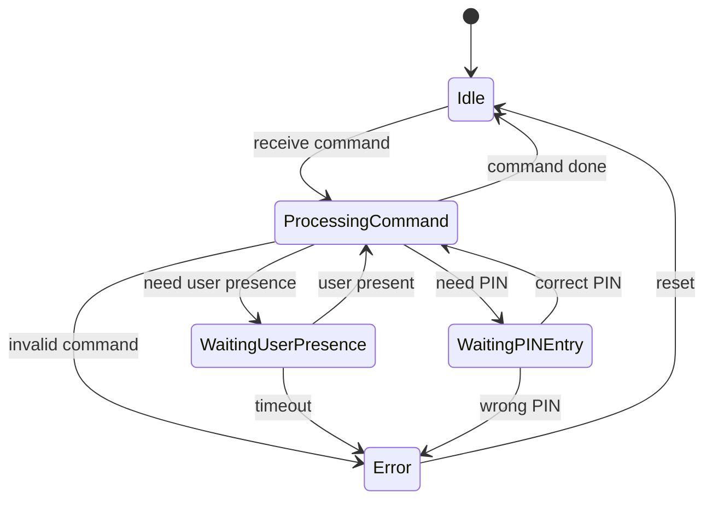

## 1. Layered Architecture

```
┌─────────────────────────────────────────────────────────────┐
│                Application Layer (APP Layer)                │
│  ┌───────────────┐  ┌───────────────┐  ┌───────────────────┐ │
│  │   FIDO2       │  │     PIV       │  │      OTP          │ │
│  │  WebAuthn     │  │   Module      │  │    Module         │ │
│  └───────────────┘  └───────────────┘  └───────────────────┘ │
├─────────────────────────────────────────────────────────────┤
│                    Platform Layer                           │
│  ┌───────────────┬───────────────┬───────────────────────┐  │
│  │   Crypto      │ Communication │      Storage          │  │
│  │   Engine      │               │                       │  │
│  └───────────────┴───────────────┴───────────────────────┘  │
│         ┌─────────────────────────────┐                     │
│         │   Communication Component   │                     │
│         │ ┌─────────────┬───────────┐ │                     │
│         │ │ Protocol    │ Transport │ │                     │
│         │ │ Layer       │ Layer     │ │                     │
│         │ │ (CTAP2,     │ (FIDO HID,│ │                     │
│         │ │ ISO7816,    │  CCID,    │ │                     │
│         │ │ Yubico OTP) │  BLE, NFC)│ │                     │
│         │ └─────────────┴───────────┘ │                     │
│         └─────────────────────────────┘                     │
├─────────────────────────────────────────────────────────────┤
│         Hardware Abstraction Layer (HAL)                    │
│  ┌───────────────┬───────────────┬───────────────────────┐  │
│  │ USB HID HAL   │ Crypto HAL    │ Storage HAL           │  │
│  └───────────────┴───────────────┴───────────────────────┘  │
└─────────────────────────────────────────────────────────────┘
                                │
                                ▼
┌─────────────────────────────────────────────────────────────┐
│                      Hardware Layer                        │
│            MCU + Crypto + Storage                          │
└─────────────────────────────────────────────────────────────┘
```
## 2. Core Components

### 2.1. Hardware Abstraction Layer (HAL)
HAL cung cấp API thống nhất cho phần cứng, bao gồm:

#### 2.1.1. USB HID HAL
USB HID HAL cung cấp interface trừu tượng cho giao tiếp USB HID, hỗ trợ FIDO2/WebAuthn qua giao thức CTAP2.

**Chức năng chính:**
- **Device Configuration**: Cấu hình USB HID device descriptors, vendor/product IDs, và HID report descriptors
- **Data Transfer**: Gửi và nhận HID reports với host system thông qua endpoint management
- **Event Management**: Xử lý USB events (connect, disconnect, suspend, resume) thông qua callback mechanism
- **Feature Reports**: Hỗ trợ HID feature reports cho device configuration
- **Status Monitoring**: Theo dõi trạng thái USB connection và device state
- **Power Management**: Hỗ trợ USB suspend/resume để tối ưu hóa năng lượng

#### 2.1.2. Storage HAL

Storage HAL cung cấp interface trừu tượng để tương tác với các thiết bị lưu trữ vật lý (flash, EEPROM, secure element) thông qua các raw storage operations.

**Chức năng chính:**
- **Raw Storage Access**: Đọc, ghi và xóa dữ liệu trực tiếp vào địa chỉ vật lý của thiết bị lưu trữ
- **Device Information**: Cung cấp thông tin về thiết bị lưu trữ như kích thước, sector size, page size
- **Storage Statistics**: Theo dõi số lượng operations và lỗi để phục vụ monitoring và debugging
- **Technology Abstraction**: Trừu tượng hóa các công nghệ lưu trữ khác nhau (Flash, EEPROM, FRAM, Secure Element)
- **Data Integrity**: Đảm bảo tính toàn vẹn dữ liệu thông qua các cơ chế flush và verification

#### 2.1.3. Crypto HAL

Crypto HAL cung cấp interface trừu tượng cho các crypto operations cơ bản, truy cập vào hardware cryptographic accelerators và secure elements.

**Chức năng chính:**
- **Cryptographic Primitives**: Cung cấp các operations cơ bản như encrypt, decrypt, sign, verify và hash
- **Key Management**: Tạo, import, export và xóa cryptographic keys
- **Random Number Generation**: Truy cập vào hardware random number generators
- **Hardware Acceleration**: Tận dụng crypto accelerators khi có
- **Secure Key Storage**: Lưu trữ keys an toàn trong secure elements hoặc hardware-protected memory

### 2.2. Platform Layer
Platform Layer chứa các thành phần nền tảng:
- **Protocol Layer**: Xử lý các giao thức (CTAP2, ISO7816, Yubico OTP)
- **Transport Layer**: Phương thức truyền tải (FIDO HID, CCID, BLE, NFC)
- **Crypto Engine**: Thực hiện thuật toán mã hóa
- **Storage**: Quản lý lưu trữ keys, credentials, settings

### 2.3. Application Layer
Application Layer chứa logic nghiệp vụ cho các module xác thực:
- **FIDO2/WebAuthn**: Passwordless authentication
- **PIV**: Enterprise authentication
- **OTP**: One-time password generation

## 3. Configuration & Plugin System

### 3.1. Feature Configuration
Hệ thống sử dụng compile-time configuration để enable/disable features:
- **FEATURE_FIDO2_ENABLED**: Bật/tắt hỗ trợ FIDO2
- **FEATURE_PIV_ENABLED**: Bật/tắt hỗ trợ PIV (cho enterprise)
- **FEATURE_OTP_ENABLED**: Bật/tắt hỗ trợ OTP
- **FEATURE_USER_VERIFICATION**: Hỗ trợ PIN
- **FEATURE_RESIDENT_KEYS**: Hỗ trợ discoverable credentials
- **FEATURE_CREDENTIAL_MGMT**: Quản lý credentials

### 3.2. Runtime Plugin Registration
Plugin system cho phép đăng ký protocols động tại runtime.

Chi tiết cấu hình và API: xem `api_specification.md`

## 4. State Machine Design

### 4.1. State Machine Diagram



### 4.2. State Machine Description

State machine quản lý luồng xử lý xác thực của thiết bị:

- **Idle**: Chờ lệnh mới từ host (browser, OS).
- **ProcessingCommand**: Đang xử lý lệnh xác thực (MakeCredential, GetAssertion, ...).
- **WaitingUserPresence**: Đợi người dùng xác nhận (nhấn nút, chạm cảm biến).
- **WaitingPINEntry**: Đợi người dùng nhập PIN để xác thực.
- **Error**: Lỗi (lệnh sai, timeout, xác thực thất bại).

### 4.3. WaitingPINEntry Use Cases

State `WaitingPINEntry` được kích hoạt trong các tình huống sau:

#### 4.3.1. FIDO2/WebAuthn Use Cases
- **MakeCredential với PIN protection**: Tạo credential mới yêu cầu PIN để đảm bảo chỉ chủ sở hữu mới có thể tạo credential
- **GetAssertion với user verification**: Xác thực yêu cầu PIN khi website yêu cầu "user verification" (userVerification="required")
- **Credential Management**: Liệt kê, xóa, hoặc quản lý resident keys đòi hỏi xác thực PIN
- **Reset Authenticator**: Reset toàn bộ thiết bị, xóa tất cả credentials (cần PIN hoặc physical reset)

#### 4.3.2. PIV (Personal Identity Verification) Use Cases
- **PIV Authentication**: Đăng nhập vào hệ thống enterprise sử dụng PIV certificate
- **Digital Signing**: Ký số tài liệu với PIV private key
- **Certificate Management**: Tạo hoặc import PIV certificates
- **Administrative Operations**: Thay đổi PIN, unlock card, reset PIV applet

#### 4.3.3. Security Requirements
- **FIPS 140-2 Compliance**: Đảm bảo tuân thủ tiêu chuẩn bảo mật cho enterprise
- **Multi-factor Authentication**: PIN (something you know) + device possession (something you have) + biometric/presence (something you are)
- **Protection Against Physical Attacks**: Ngay cả khi thiết bị bị mất, attacker không thể sử dụng được mà không có PIN

#### 4.3.4. Ví dụ Workflow
```
1. User truy cập website banking yêu cầu strong authentication
2. Website gọi navigator.credentials.get({userVerification: "required"})
3. Browser gửi CTAP2 GetAssertion command với uv=true
4. Device chuyển từ Idle → ProcessingCommand
5. Device phát hiện cần user verification → WaitingPINEntry  
6. Device hiển thị prompt "Enter PIN"
7. User nhập PIN → Device verify PIN
8. Nếu PIN đúng → ProcessingCommand → tạo assertion → Idle
9. Nếu PIN sai → Error → Idle (có thể lockout sau nhiều lần sai)
```

Luồng chuyển trạng thái:
- Khi nhận lệnh, chuyển từ Idle sang ProcessingCommand.
- Nếu lệnh yêu cầu xác nhận người dùng, chuyển sang WaitingUserPresence.
- Nếu lệnh yêu cầu nhập PIN, chuyển sang WaitingPINEntry.
- Nếu có lỗi, chuyển sang Error.
- Khi xử lý xong hoặc reset, quay về Idle.

State machine này giúp hệ thống kiểm soát logic xác thực, đảm bảo bảo mật và trải nghiệm người dùng mượt mà.

## 5. Security Architecture

### 5.1. Authentication Levels

Framework hỗ trợ 3 levels xác thực theo FIDO2 specification:

#### 5.1.1. User Presence (UP)
- **Yêu cầu**: Chỉ cần xác nhận vật lý (nhấn nút, chạm cảm biến)
- **Use case**: Đăng nhập websites thông thường
- **State transition**: ProcessingCommand → WaitingUserPresence
- **Security level**: Cơ bản - chống remote attacks

#### 5.1.2. User Verification (UV) 
- **Yêu cầu**: PIN + User presence 
- **Use case**: Banking, enterprise login, sensitive operations
- **State transition**: ProcessingCommand → WaitingPINEntry → WaitingUserPresence
- **Security level**: Cao - chống physical attacks khi device bị mất

#### 5.1.3. No User Interaction
- **Yêu cầu**: Không cần tương tác (chỉ có device possession)
- **Use case**: Silent authentication, background operations
- **State transition**: ProcessingCommand → Idle
- **Security level**: Thấp - chỉ verification device

### 5.2. PIN Security Model

#### 5.2.1. Khi nào cần PIN?
```
FIDO2 Operations:
├── MakeCredential
│   ├── requireResidentKey=true → PIN required
│   ├── userVerification="required" → PIN required  
│   └── userVerification="preferred" → PIN optional
├── GetAssertion  
│   ├── userVerification="required" → PIN required
│   ├── allowList=empty (resident key) → PIN required
│   └── userVerification="discouraged" → No PIN
├── GetInfo → No PIN needed
├── Reset → PIN or Physical reset
└── CredentialManagement → PIN required
```

#### 5.2.2. PIN Protection Features
- **Retry counter**: 8 lần thử sai → lockout
- **PIN complexity**: Tối thiểu 4 ký tự, tối đa 63 ký tự UTF-8
- **Brute force protection**: Exponential backoff delay
- **Secure PIN storage**: PIN hash được lưu encrypted

### 5.3. Key Management
Hệ thống quản lý keys an toàn với:
- **Secure key storage**: Lưu trữ keys được mã hóa/wrapped
- **Key derivation**: Sinh keys từ master secret
- **Key rotation**: Cơ chế thay đổi keys định kỳ

### 5.4. Access Control
Kiểm soát truy cập thông qua:
- **PIN verification**: Xác thực PIN người dùng
- **User presence detection**: Phát hiện người dùng có mặt
- **Retry counter**: Giới hạn số lần thử sai

### 5.5. Security Features
- **Secure boot**: Khởi động an toàn
- **Tamper resistance**: Chống can thiệp vật lý
- **Side-channel protection**: Chống tấn công kênh phụ

Chi tiết API bảo mật: xem `api_specification.md`

## 6. Build System & Portability

### 6.1. Directory Structure (theo kiến trúc mới)
```
docs/                     # Tài liệu kiến trúc, phân tích, hướng dẫn
src/
├── app/                  # Application Layer (FIDO2, PIV, OTP, ...)
│   ├── fido2/
│   ├── piv/
│   └── otp/
├── platform/             # Platform Layer
│   ├── crypto/           # Crypto Engine
│   ├── storage/          # Storage management
│   └── communication/    # Communication (protocol & transport)
│       ├── protocol/     # Protocol Layer (ctap2, iso7816, yubico_otp, ...)
│       │   ├── ctap2/
│       │   ├── iso7816/
│       │   └── yubico_otp/
│       └── transport/    # Transport Layer (fido_hid, ccid, ble, ...)
│           ├── fido_hid/
│           ├── ccid/
│           └── ble/
├── hal/                  # Hardware Abstraction Layer
│   ├── interface/        # HAL interface definitions
│   ├── stm32/            # STM32-specific implementation
│   ├── esp32/            # ESP32-specific implementation
│   └── mock/             # Mock implementation for testing
├── core/                 # Core framework (events, state machine)
└── config/               # Configuration files
```

### 6.2. CMake Build System
Hệ thống build sử dụng CMake với các options:
- **TARGET_MCU**: Chọn MCU family (STM32F4, ESP32, ...)
- **ENABLE_FIDO2**: Bật/tắt FIDO2 support
- **ENABLE_PIV**: Bật/tắt PIV support  
- **ENABLE_DEBUG**: Bật/tắt debug features

Platform-specific HAL được chọn tự động dựa trên TARGET_MCU.

Chi tiết CMake configuration: xem build system documentation.

