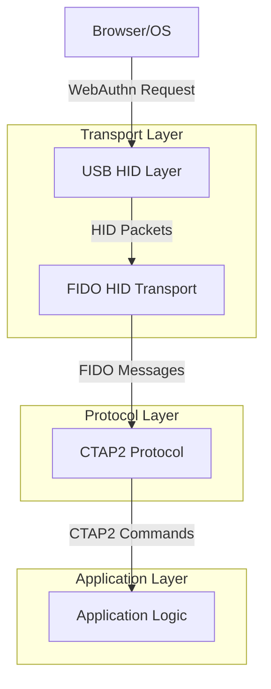
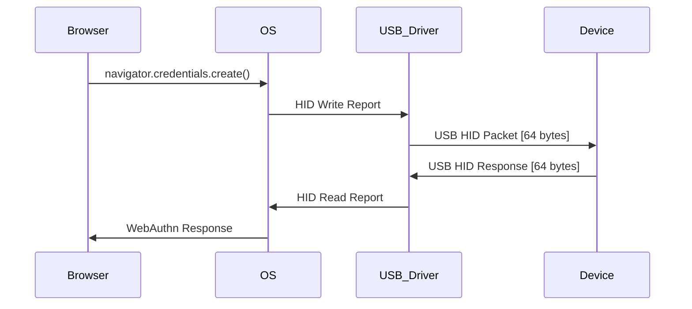
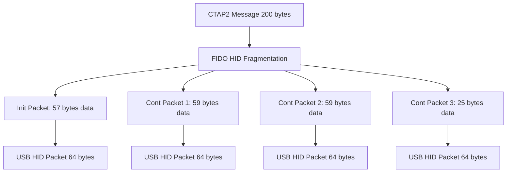
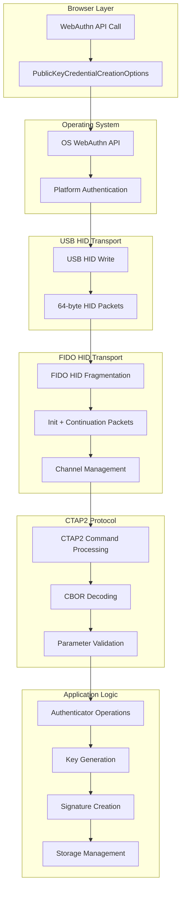

# Data Structure & Protocol Analysis

Tài liệu này phân tích chi tiết cấu trúc dữ liệu và cách mapping giữa các layer trong hệ thống USB Key Authentication.

## 1. Protocol Stack Overview



## 2. USB HID Protocol (Transport Layer)

### 2.1. USB HID Packet Structure

```c
// USB HID Packet (64 bytes)
typedef struct __attribute__((packed)) {
    uint8_t report_id;           // Optional (0 if not used)
    uint8_t data[63];           // HID data payload
} usb_hid_packet_t;

// HID Report Descriptor for FIDO
static const uint8_t fido_hid_report_descriptor[] = {
    0x06, 0xD0, 0xF1,    // Usage Page (FIDO Alliance)
    0x09, 0x01,          // Usage (U2F HID Authenticator Device)
    0xA1, 0x01,          // Collection (Application)
    0x09, 0x20,          //   Usage (Input Report Data)
    0x15, 0x00,          //   Logical Minimum (0)
    0x26, 0xFF, 0x00,    //   Logical Maximum (255)
    0x75, 0x08,          //   Report Size (8 bits)
    0x95, 0x40,          //   Report Count (64 bytes)
    0x81, 0x02,          //   Input (Data,Var,Abs)
    0x09, 0x21,          //   Usage (Output Report Data)
    0x15, 0x00,          //   Logical Minimum (0)
    0x26, 0xFF, 0x00,    //   Logical Maximum (255)
    0x75, 0x08,          //   Report Size (8 bits)
    0x95, 0x40,          //   Report Count (64 bytes)
    0x91, 0x02,          //   Output (Data,Var,Abs)
    0xC0                 // End Collection
};
```

### 2.2. USB HID Data Flow Visualization



## 3. FIDO HID Protocol (Transport Layer)

### 3.1. FIDO HID Packet Structure

FIDO HID protocol chạy trên USB HID và chia nhỏ messages thành packets 64-byte:

```c
#define FIDO_HID_PACKET_SIZE        64
#define FIDO_HID_INIT_HEADER_SIZE   7
#define FIDO_HID_CONT_HEADER_SIZE   5

// FIDO HID Initialization Packet
typedef struct __attribute__((packed)) {
    uint32_t channel_id;        // 4 bytes - Channel identifier (big-endian)
    uint8_t command;            // 1 byte - Command code
    uint16_t payload_length;    // 2 bytes - Total payload length (big-endian)
    uint8_t data[57];          // 57 bytes - First chunk of data
} fido_hid_init_packet_t;

// FIDO HID Continuation Packet
typedef struct __attribute__((packed)) {
    uint32_t channel_id;        // 4 bytes - Same channel ID
    uint8_t sequence;           // 1 byte - Sequence number (0x00-0x7F)
    uint8_t data[59];          // 59 bytes - Continuation data
} fido_hid_cont_packet_t;

// FIDO HID Commands
#define FIDO_HID_CMD_PING       0x81
#define FIDO_HID_CMD_MSG        0x83    // CTAP message
#define FIDO_HID_CMD_INIT       0x86
#define FIDO_HID_CMD_WINK       0x88
#define FIDO_HID_CMD_CBOR       0x90    // CTAP2 message
#define FIDO_HID_CMD_CANCEL     0x91
#define FIDO_HID_CMD_ERROR      0xBF
```

### 3.2. FIDO HID Message Fragmentation



### 3.3. FIDO HID Data Structure Example

```c
// Example: 200-byte CTAP2 message fragmentation
void fragment_fido_message(uint8_t* message, size_t msg_len, uint32_t channel_id) {
    // Init packet
    fido_hid_init_packet_t init_pkt = {
        .channel_id = htonl(channel_id),
        .command = FIDO_HID_CMD_CBOR,
        .payload_length = htons(msg_len)
    };
    
    size_t copied = 0;
    size_t chunk_size = MIN(msg_len, 57);
    memcpy(init_pkt.data, message, chunk_size);
    copied += chunk_size;
    
    send_usb_hid_packet((uint8_t*)&init_pkt, FIDO_HID_PACKET_SIZE);
    
    // Continuation packets
    uint8_t seq = 0;
    while (copied < msg_len) {
        fido_hid_cont_packet_t cont_pkt = {
            .channel_id = htonl(channel_id),
            .sequence = seq++
        };
        
        chunk_size = MIN(msg_len - copied, 59);
        memcpy(cont_pkt.data, message + copied, chunk_size);
        copied += chunk_size;
        
        send_usb_hid_packet((uint8_t*)&cont_pkt, FIDO_HID_PACKET_SIZE);
    }
}
```

## 4. CTAP2 Protocol (Protocol Layer)

### 4.1. CTAP2 Message Structure

```c
// CTAP2 Message Format
typedef struct {
    uint8_t command;            // 1 byte - CTAP2 command
    uint8_t payload[];          // Variable - CBOR encoded data
} ctap2_message_t;

// CTAP2 Commands
#define CTAP2_AUTHENTICATOR_MAKE_CREDENTIAL     0x01
#define CTAP2_AUTHENTICATOR_GET_ASSERTION       0x02
#define CTAP2_AUTHENTICATOR_GET_INFO            0x04
#define CTAP2_AUTHENTICATOR_CLIENT_PIN          0x06
#define CTAP2_AUTHENTICATOR_RESET               0x07
#define CTAP2_AUTHENTICATOR_GET_NEXT_ASSERTION  0x08
```

### 4.2. CTAP2 CBOR Data Structures

```c
// MakeCredential Request (CBOR Map)
typedef struct {
    // Key 1: clientDataHash (required)
    uint8_t client_data_hash[32];
    
    // Key 2: rp (required)
    struct {
        char* id;               // "example.com"
        char* name;             // "Example Corp"
        char* icon;             // Optional
    } rp;
    
    // Key 3: user (required)
    struct {
        uint8_t* id;            // User handle
        size_t id_len;
        char* name;             // "john.doe@example.com"
        char* display_name;     // "John Doe"
        char* icon;             // Optional
    } user;
    
    // Key 4: pubKeyCredParams (required)
    struct {
        char* type;             // "public-key"
        int alg;                // -7 for ES256
    }* cred_params;
    size_t cred_params_count;
    
    // Key 5: excludeList (optional)
    struct {
        char* type;             // "public-key"
        uint8_t* id;
        size_t id_len;
    }* exclude_list;
    size_t exclude_list_count;
    
    // Key 6: extensions (optional)
    uint8_t* extensions;
    
    // Key 7: options (optional)
    struct {
        bool rk;                // Resident key
        bool uv;                // User verification
    } options;
    
    // Key 8: pinAuth (optional)
    uint8_t* pin_auth;
    size_t pin_auth_len;
    
    // Key 9: pinProtocol (optional)
    uint8_t pin_protocol;
    
} ctap2_make_credential_req_t;

// MakeCredential Response (CBOR Map)
typedef struct {
    // Key 1: fmt (required)
    char* fmt;                  // "packed", "tpm", "android-key", etc.
    
    // Key 2: authData (required)
    uint8_t* auth_data;
    size_t auth_data_len;
    
    // Key 3: attStmt (required)
    uint8_t* att_stmt;          // CBOR encoded attestation statement
    size_t att_stmt_len;
    
} ctap2_make_credential_resp_t;
```

### 4.3. Authenticator Data Structure

```c
// Authenticator Data (part of CTAP2 response)
typedef struct __attribute__((packed)) {
    uint8_t rp_id_hash[32];         // SHA-256(rp.id)
    uint8_t flags;                  // UP|UV|AT|ED flags
    uint32_t sign_count;            // Signature counter (big-endian)
    
    // Optional: Attested Credential Data (when AT=1)
    uint8_t aaguid[16];             // Authenticator AAGUID
    uint16_t cred_id_length;        // Credential ID length (big-endian)
    uint8_t* credential_id;         // Credential ID
    uint8_t* public_key_cbor;       // COSE Key format (CBOR)
    
    // Optional: Extensions (when ED=1)
    uint8_t* extensions_cbor;       // CBOR encoded extensions
} authenticator_data_t;

// Flags in authenticator data
#define AUTHDATA_FLAG_UP    0x01    // User Present
#define AUTHDATA_FLAG_UV    0x04    // User Verified
#define AUTHDATA_FLAG_AT    0x40    // Attested credential data included
#define AUTHDATA_FLAG_ED    0x80    // Extension data included
```

## 5. Data Flow Mapping Between Layers

### 5.1. Complete Data Flow Visualization



### 5.2. Data Transformation Example

```c
// Example: MakeCredential data flow
void process_make_credential_flow() {
    // 1. Browser sends WebAuthn request
    // navigator.credentials.create({publicKey: options})
    
    // 2. OS converts to CTAP2 format
    uint8_t ctap2_request[] = {
        0x01,                           // CTAP2_AUTHENTICATOR_MAKE_CREDENTIAL
        // CBOR encoded parameters...
        0xA5,                           // CBOR map with 5 keys
        0x01, 0x58, 0x20, /* ... */,    // clientDataHash
        0x02, 0xA2, /* ... */,          // rp
        0x03, 0xA4, /* ... */,          // user
        0x04, 0x81, /* ... */,          // pubKeyCredParams
        0x07, 0xA1, /* ... */           // options
    };
    
    // 3. FIDO HID wraps CTAP2 message
    fido_hid_init_packet_t hid_pkt = {
        .channel_id = 0x12345678,
        .command = FIDO_HID_CMD_CBOR,
        .payload_length = sizeof(ctap2_request),
        // .data contains first 57 bytes of ctap2_request
    };
    
    // 4. USB HID sends 64-byte packets
    usb_hid_packet_t usb_pkt;
    memcpy(usb_pkt.data, &hid_pkt, sizeof(hid_pkt));
    usb_hid_send_report(&usb_pkt);
    
    // 5. Device processes and responds
    ctap2_make_credential_resp_t response = {
        .fmt = "packed",
        .auth_data = authenticator_data,
        .auth_data_len = auth_data_length,
        .att_stmt = attestation_statement,
        .att_stmt_len = att_stmt_length
    };
    
    // 6. Encode response to CBOR
    uint8_t cbor_response[512];
    size_t cbor_len = encode_make_credential_response(&response, cbor_response);
    
    // 7. Send back through same layers in reverse
}
```

### 5.3. Protocol Mapping Table

| Layer | Data Format | Size | Purpose |
|-------|-------------|------|---------|
| **WebAuthn** | JavaScript Objects | Variable | Browser API interface |
| **Platform API** | Platform-specific | Variable | OS abstraction |
| **USB HID** | HID Reports | 64 bytes | Physical transport |
| **FIDO HID** | Fragmented Messages | Variable | Reliable messaging |
| **CTAP2** | CBOR Encoded | Variable | Authentication protocol |
| **Application** | C Structures | Variable | Business logic |

### 5.4. Error Handling Across Layers

```c
// Error propagation from Application to Browser
typedef enum {
    // USB HID Level Errors
    USB_HID_ERROR_TIMEOUT           = 0x01,
    USB_HID_ERROR_DEVICE_NOT_FOUND  = 0x02,
    
    // FIDO HID Level Errors  
    FIDO_HID_ERROR_INVALID_CHANNEL  = 0x0B,
    FIDO_HID_ERROR_INVALID_COMMAND  = 0x01,
    FIDO_HID_ERROR_INVALID_LENGTH   = 0x03,
    
    // CTAP2 Level Errors
    CTAP2_ERR_SUCCESS              = 0x00,
    CTAP2_ERR_INVALID_COMMAND      = 0x01,
    CTAP2_ERR_INVALID_PARAMETER    = 0x02,
    CTAP2_ERR_INVALID_LENGTH       = 0x03,
    CTAP2_ERR_INVALID_SEQ          = 0x04,
    CTAP2_ERR_TIMEOUT              = 0x05,
    CTAP2_ERR_CHANNEL_BUSY         = 0x06,
    CTAP2_ERR_LOCK_REQUIRED        = 0x0A,
    CTAP2_ERR_INVALID_CHANNEL      = 0x0B,
    CTAP2_ERR_CBOR_UNEXPECTED_TYPE = 0x11,
    CTAP2_ERR_INVALID_CBOR         = 0x12,
    CTAP2_ERR_MISSING_PARAMETER    = 0x14,
    CTAP2_ERR_LIMIT_EXCEEDED       = 0x15,
    CTAP2_ERR_UNSUPPORTED_EXTENSION = 0x16,
    CTAP2_ERR_CREDENTIAL_EXCLUDED  = 0x19,
    CTAP2_ERR_PROCESSING           = 0x21,
    CTAP2_ERR_INVALID_CREDENTIAL   = 0x22,
    CTAP2_ERR_USER_ACTION_PENDING  = 0x23,
    CTAP2_ERR_OPERATION_PENDING    = 0x24,
    CTAP2_ERR_NO_OPERATIONS        = 0x25,
    CTAP2_ERR_UNSUPPORTED_ALGORITHM = 0x26,
    CTAP2_ERR_OPERATION_DENIED     = 0x27,
    CTAP2_ERR_KEY_STORE_FULL       = 0x28,
    CTAP2_ERR_NO_OPERATION_PENDING = 0x2A,
    CTAP2_ERR_UNSUPPORTED_OPTION   = 0x2B,
    CTAP2_ERR_INVALID_OPTION       = 0x2C,
    CTAP2_ERR_KEEPALIVE_CANCEL     = 0x2D,
    CTAP2_ERR_NO_CREDENTIALS       = 0x2E,
    CTAP2_ERR_USER_ACTION_TIMEOUT  = 0x2F,
    CTAP2_ERR_NOT_ALLOWED          = 0x30,
    CTAP2_ERR_PIN_INVALID          = 0x31,
    CTAP2_ERR_PIN_BLOCKED          = 0x32,
    CTAP2_ERR_PIN_AUTH_INVALID     = 0x33,
    CTAP2_ERR_PIN_AUTH_BLOCKED     = 0x34,
    CTAP2_ERR_PIN_NOT_SET          = 0x35,
    CTAP2_ERR_PIN_REQUIRED         = 0x36,
    CTAP2_ERR_PIN_POLICY_VIOLATION = 0x37,
    CTAP2_ERR_PIN_TOKEN_EXPIRED    = 0x38,
    CTAP2_ERR_REQUEST_TOO_LARGE    = 0x39,
    CTAP2_ERR_ACTION_TIMEOUT       = 0x3A,
    CTAP2_ERR_UP_REQUIRED          = 0x3B
} ctap2_error_t;

// Error mapping function
int map_ctap2_error_to_webauthn(ctap2_error_t ctap_error) {
    switch(ctap_error) {
        case CTAP2_ERR_SUCCESS:
            return WEBAUTHN_SUCCESS;
        case CTAP2_ERR_USER_ACTION_TIMEOUT:
            return WEBAUTHN_ERROR_TIMEOUT;
        case CTAP2_ERR_OPERATION_DENIED:
            return WEBAUTHN_ERROR_NOT_ALLOWED;
        case CTAP2_ERR_UNSUPPORTED_ALGORITHM:
            return WEBAUTHN_ERROR_NOT_SUPPORTED;
        default:
            return WEBAUTHN_ERROR_UNKNOWN;
    }
}
```

## 6. Performance Considerations

### 6.1. Latency Analysis

```c
// Typical latency breakdown for MakeCredential
typedef struct {
    uint32_t usb_transfer_time;     // ~1-2ms per packet
    uint32_t hid_processing_time;   // ~0.1ms
    uint32_t ctap2_parsing_time;    // ~1-2ms
    uint32_t crypto_operation_time; // ~50-100ms (key generation)
    uint32_t storage_write_time;    // ~5-10ms
    uint32_t response_encoding_time; // ~1-2ms
} performance_metrics_t;

// Total latency: ~60-120ms for typical MakeCredential
```

### 6.2. Memory Usage

```c
// Memory requirements for different layers
#define USB_HID_BUFFER_SIZE         64      // Single packet
#define FIDO_HID_MAX_MESSAGE_SIZE   7609    // Maximum FIDO message
#define CTAP2_MAX_REQUEST_SIZE      1024    // Typical CTAP2 request
#define CTAP2_MAX_RESPONSE_SIZE     1024    // Typical CTAP2 response
#define CBOR_ENCODE_BUFFER_SIZE     2048    // CBOR encoding workspace

// Total RAM usage: ~12KB for buffers + application data
```

## 7. Security Considerations

### 7.1. Data Protection Across Layers

```c
// Secure data handling
typedef struct {
    uint8_t* sensitive_data;
    size_t data_len;
    bool is_encrypted;
    uint32_t access_flags;
} secure_buffer_t;

// Clear sensitive data after use
void secure_clear_buffer(secure_buffer_t* buf) {
    if (buf->sensitive_data) {
        explicit_bzero(buf->sensitive_data, buf->data_len);
        buf->data_len = 0;
        buf->is_encrypted = false;
    }
}
```

### 7.2. Channel Security

```c
// FIDO HID channel isolation
typedef struct {
    uint32_t channel_id;
    uint32_t capabilities;
    bool authenticated;
    uint8_t session_key[32];
} fido_hid_channel_t;

// Prevent channel hijacking
bool validate_channel_access(fido_hid_channel_t* channel, uint32_t requested_channel) {
    return (channel->channel_id == requested_channel) && channel->authenticated;
}
```

## Kết Luận

Hệ thống USB Key Authentication sử dụng stack protocol phân tầng:

1. **USB HID**: Physical transport (64-byte packets)
2. **FIDO HID**: Reliable messaging và fragmentation
3. **CTAP2**: Authentication protocol (CBOR encoded)
4. **Application**: Business logic implementation

Mỗi tầng có data format riêng và chức năng cụ thể, đảm bảo tính modularity, security và interoperability với các browser và platform khác nhau.