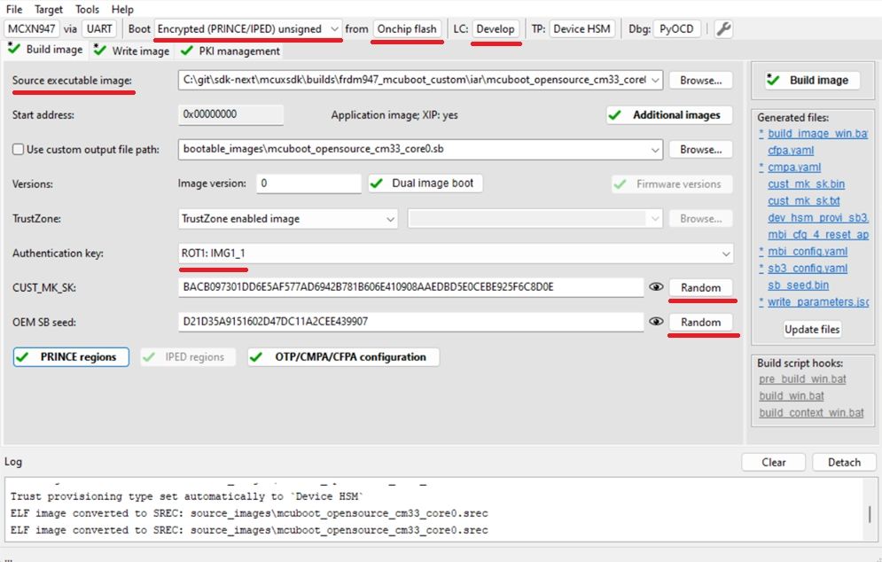
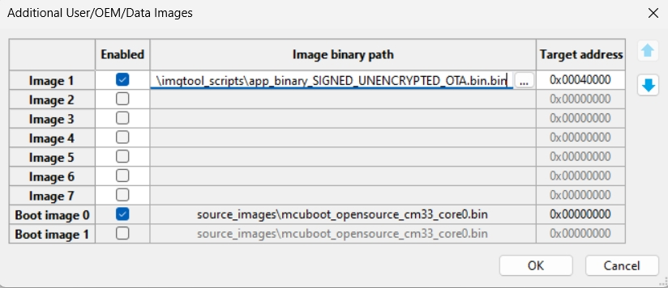
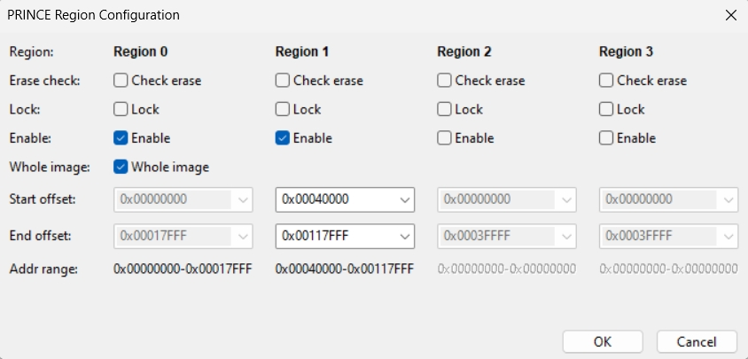
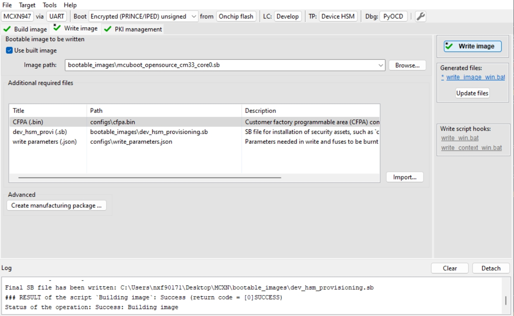

# Encrypted XIP and NPX 

This document extends the documentation of [MCUBoot and encrypted XIP in OTA examples](encrypted_xip_readme.md) and provides a walkthrough to evaluate it on devices with NPX module. 

__Note: The current state of NPX example implementation for SDK 25.06 is in an experimental state. The IV reconfiguration is not implemented yet and it's planned for SDK 25.09 release.__

## 1. Introduction

The flash memory controller's NPX (NVM PRINCE Encryption/Decryption) submodule provides on-the-fly encryption and decryption using the PRINCE algorithm, eliminating the need for external pre-encryption or key knowledge. PRINCE is a lightweight symmetric key cipher that operates on 64-bit data blocks with 128-bit secret keys. This on-the-fly encryption system enhances security for embedded processor applications without compromising system performance.

Additional information can be found in the reference manual and application notes AN14087 and AN14096.

The current example implementation doesn't use customized configuration block as NPX encryption is fully handled by ROM using CMPA and CFPA pages.

# 2. Instructions

OTA examples for MCXN9 use the default partition layout with MCUboot placed in the IFR region to utilize the flash remapping feature. In the case of utilizing the NPX module, this configuration is not supported by ROM, and it is required to have the bootloader in the same flash array as the application slots. For this purpose, a customized build with the bootloader placed in the main flash array is provided.

Instructions how to generate project with custom configuration is in `example_board_readme.md` for target board:

- [FRDM-MCXN947](../../_boards/frdmmcxn947/ota_examples/mcuboot_opensource/example_board_readme.md)
- [MCX-N5XX-EVK](../../_boards/mcxn5xxevk/ota_examples/mcuboot_opensource/example_board_readme.md)
- [MCX-N9XX-EVK](../../_boards/mcxn9xxevk/ota_examples/mcuboot_opensource/example_board_readme.md)

Note: Following instructions are for FRDM-MCXN947 as a reference. 

### 2.1 Enable encrypted XIP support and build projects

1. Generate customized project for `mcuboot_opensource` and `ota_mcuboot_***` example

Bootloader:
~~~
west build -p always examples/ota_examples/mcuboot_opensource -b frdmmcxn947 --config debug --toolchain iar --target guiproject -Dcore_id=cm33_core0 -DCONF_FILE="examples/ota_examples/_custom_cfg/mcxn_mcuboot_in_main_flash/mcuboot_opensource.conf"
~~~
OTA application:
~~~
west build -p always examples/ota_examples/ota_mcuboot_basic -b frdmmcxn947 --config debug --toolchain iar --target guiproject -Dcore_id=cm33_core0 -DCONF_FILE="examples/ota_examples/_custom_cfg/mcxn_mcuboot_in_main_flash/ota_mcuboot_basic.conf"
~~~

2. Enable the define `CONFIG_ENCRYPT_XIP_EXT_ENABLE` in `sblconfig.h`.
3. Build mcuboot_opensource and the OTA application.

### 2.2 Sign and encrypt OTA image

To sign and encrypt an application binary, imgtool must be provided with the respective key pairs and a set of parameters as in the following example.

Build an unencrypted initial MCUboot image which will be used as initial application together with the bootloader:
~~~
 imgtool sign --key sign-rsa2048-priv.pem
	      --align 16
	      --header-size 0x400
	      --pad-header
	      --slot-size 0xE0000
	      --max-sectors 111
	      --version "1.0"
	      app_binary.bin
	      app_binary_SIGNED_UNENCRYPTED_OTA.bin
~~~

Build an encrypted MCUboot image for OTA:
~~~
 imgtool sign --key sign-rsa2048-priv.pem
	      --align 16
	      --header-size 0x400
	      --pad-header
	      --slot-size 0xE0000
	      --max-sectors 111
	      --version "1.1"
	      -E enc-rsa2048-pub.pem
	      app_binary.bin
	      app_binary_SIGNED_ENCRYPTED_OTA.bin
~~~

The values of parameters can be obtained from a readme file of target board (see `example_board_readme.md`).

### 2.3 Configure the device and load bootloader with initial image

The device must be provisioned to support NPX encryption. To simplify the workflow, the MCUXpresso Secure Provisioning Tool (SEC tool) is used.

Perform the following steps:

1. Erase the device
2. Get the device into ISP mode - typically on development boards hold the ISP button and press the reset button
3. Open the SEC tool and create new workspace for MCXN target device, test the ISP connection
4. Switch to PKI management tab
    * Click __Generate keys__ (leave default settings)

5. Build Image tab
    * Boot: __Encrypted (PRINCE/IPED) Unsigned__ from __Onchip flash__
    * Source executable image: provide mcuboot binary or elf file
    * Lifecycle: Develop
    * Select an __authentication key__ and generate __CUST_MK_SK__ and __OEM SB seed__

6. Add additional binary as an initial OTA application

Note: see define `BOOT_FLASH_ACT_APP` in `flash_partitioning.h` of the project or consult the `example_board_readme.md` to configure correct target address offset value.

7. Setup __PRINCE regions__
    * Region 0: Select __Enable__ and __Whole image__
    * Region 1: Select __Enable__, start offset 0x40000 and offset 0x117FFF

 Region 0 is the encrypted MCUboot application to secure the private key embedded in MCUboot code to decrypt the encrypted OTA image by MCUboot.
 Region 1 is the encrypted region of execution slot (slot 0) to utilize encrypted XIP. The last 32kB block (0x118000 - 0x11FFFF) is left unencrypted for slot trailer handling by the MCUboot update process
 The staging area (slot 1) is left unencrypted as an OTA image staged here is encrypted anyway by MCUboot. Usage of region 2 here is optional.

8. __Build__ and __Write image__

### 2.4 Run the application

Perform an OTA update as usual. 

Following example log is from `ota_mcuboot_basic`:

~~~
hello sbl.
Bootloader Version 2.1.0
Image index: 0, Swap type: none
Bootloader chainload address offset: 0x40000
Reset_Handler address offset: 0x40400
Jumping to the image

*************************************
* Basic MCUBoot application example *
*************************************

Built May 22 2025 18:13:01

$ image erase
Erasing inactive slot...done
$ xmodem
Started xmodem download into flash at 0x120000
Initiated XMODEM-CRC transfer. Receiving... (Press 'x' to cancel)
CCCCCC
Received 31744 bytes
SHA256 of received data: 1DE5009C847F35A17FA6...
SHA256 of flashed data:  1DE5009C847F35A17FA6...
$
$ image test
write magic number offset = 0x1fff80
$ reboot
System reset!
hello sbl.
Bootloader Version 2.1.0
Image index: 0, Swap type: test
Image 0 upgrade secondary slot -> primary slot
Erasing the primary slot
Image 0 copying the secondary slot to the primary slot: 0x7930 bytes
writing magic; fa_id=0 off=0xdfff0 (0x11fff0)
erasing secondary header
erasing secondary trailer
Bootloader chainload address offset: 0x40000
Reset_Handler address offset: 0x40400
Jumping to the image

*************************************
* Basic MCUBoot application example *
*************************************

Built May 22 2025 18:13:01

$ image
Image 0; name APP; state None:

  Slot 0 APP_PRIMARY; offset 0x40000; size 0xe0000 (917504):
    <IMAGE: size 29392; version 1.1.0>
    SHA256 of image payload: 23966037B3ADFC30DDE6...
    *ACTIVE*

  Slot 1 APP_SECONDARY; offset 0x120000; size 0xe0000 (917504):
    <No Image Found>

$
~~~