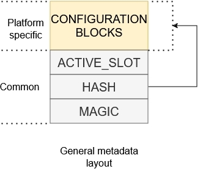

# Encrypted XIP and MCUboot

- [1. Introduction](#1-introduction)
- [2. MCUboot encrypted image](#2-mcuboot-encrypted-image)
- [3. Encrypted XIP extension for MCUboot](#3-encrypted-xip-extension-for-mcuboot)
   * [3.1 Configuration structures](#31-configuration-structures)
   * [3.2 Modes of the extension](#32-modes-of-the-extension)
      + [3.2.1 Three slot configuration](#321-three-slot-configuration)
      + [3.2.2 Overwrite-only mode](#322-overwrite-only-mode)
- [4. NXP encryption engines](#4-nxp-encryption-engines)
   * [4.1 BEE (Bus Encryption Engine)](#41-bee-bus-encryption-engine)
      + [4.1.1 Supported boards](#411-supported-boards)
   * [4.2 OTFAD (On-the-Fly AES Decryption Module)](#42-otfad-on-the-fly-aes-decryption-module)
   * [4.3 IPED (Inline Prince Encryption/Decryption for off-chip flash)](#43-iped-inline-prince-encryptiondecryption-for-off-chip-flash)
      + [4.3.1 Supported boards](#431-supported-boards)
   * [4.4 NPX (PRINCE encryption/decryption for on-chip flash)](#44-npx-prince-encryptiondecryption-for-on-chip-flash)
      + [4.4.1 Supported boards](#441-supported-boards)
- [5. OTA examples instructions](#5-ota-examples-instructions)
   * [5.1 Generate RSA key pairs for encrypted image containers](#51-generate-rsa-key-pairs-for-encrypted-image-containers)
   * [5.2 Enable encrypted XIP support and build projects](#52-enable-encrypted-xip-support-and-build-projects)
   * [5.3 Sign and encrypt image](#53-sign-and-encrypt-image)
   * [5.4 Evaluate encrypted XIP example](#54-evaluate-encrypted-xip-example)
      + [5.4.1 Load encrypted image container to flash memory](#541-load-encrypted-image-container-to-flash-memory)
      + [5.4.2 Run unsigned unencrypted OTA application (debug session)](#542-run-unsigned-unencrypted-ota-application-debug-session)
   * [5.5 Running encrypted image](#55-running-encrypted-image)

## 1. Introduction

To provide confidentiality of image data while in transport to the device or while residing on an non-secure storage such as external flash memory, MCUboot has support for encrypting/decrypting images on-the-fly while upgrading. MCUboot architecture expects that XIP is done from a secure memory so encrypted image is decrypted to a secure location such as internal Flash or RAM, however, size of an internal RAM is limited and there are devices with interfaces to only external flash memory.

Some NXP devices support encrypted XIP on an internal or external Flash device utilizing on-the-fly decryption modules (BEE, OTFAD, IPED, NPX...). Is possible use these decryption engines with a second stage bootloader as the MCUboot.

This document describes an extension of MCUboot functionality to support encrypted XIP on NXP devices and its enablement in OTA examples in MCUXpresso SDK.

## 2. MCUboot encrypted image

In the extension, the image encrypted by MCUboot is used as a secure capsule for transport and staging in the non-XIP area of a device.

In summary, an image payload is encrypted using AES-CTR cipher by image tool (see [imgtool](https://docs.mcuboot.com/imgtool.html)). The AES key is randomized per OTA image and padded to image as an encrypted TLV section. The encrypted AES key can be decrypted using private key in selected key encryption scheme (RSA-OAEP, AES-KW, ECIES-P256 or ECIES-X25519).

Following image shows keys management of MCUboot encrypted image.

As shown in the image, a user must securely embed the encryption private key into the device. For simplicity, the OTA examples in SDK use private keys embedded as a C array in MCUboot code (see `middleware\mcuboot_opensource\boot\nxp_mcux_sdk\keys.c`). Users are advised to implement secure provisioning and loading of the private key in the device, for example by encrypting the MCUboot application (including the array) using the encrypted XIP feature of the device, or by staging the private key in trusted sources like OTP or TPM (supported since MCUboot 2.2.0).

For more information please see [MCUboot Encrypted images documentation](https://docs.mcuboot.com/encrypted_images.html). 

## 3. Encrypted XIP extension for MCUboot

The extension combines usage of platform specific encrypted XIP feature and funcionality of MCUboot encrypted images created by imgtool. 

Following image shows simplified OTA update flow of device fleet using encrypted XIP extension.

The device fleet shares a common MCUboot private key used for decryption of encrypted OTA images residing in staging areas. The MCUboot AES key and hardware encryption module are then used for image re-encryption to the execution area. The hardware key is provisioned by NXP or the user and is typically unique per device instance to prevent image cloning

### 3.1 Configuration structures

In summary, every NXP encryption module utilizing the encrypted XIP feature uses a scheme where on-the-fly decryption is configured by ROM. After device reset, the ROM investigates specific configuration structures typically expected at a particular flash offset in the header of the bootable image, which is MCUboot in our case. If configuration structures consisting of encrypted keys and IVs are valid, then the ROM configures the encryption module for encrypted XIP.

In the case of an OTA update, it is expected that for security reasons we have to update the key or IV of the encrypted execution region, so these configuration blocks also have to be re-generated for each OTA update. Unfortunately, this creates a risk during the update of these configuration blocks, as there is a period of time where a power loss could corrupt the update and result in a bricked device.

Note: The risk is related only to use cases using a custom second-stage bootloader. OTA solutions using only a ROM bootloader typically utilize a dual image feature which safely handles this issue, as the ROM can safely revert to the last functional configuration.

The risk is resolved by moving configuration blocks out of the header of the second stage bootloader to a particular flash area and letting the bootloader configure the encryption module manually by inspecting these configuration blocks.

The encrypted XIP extension uses a reserved area called encryption metadata which is used for storage of configuration blocks and encrypted XIP handling. The following image shows the general structure of encryption metadata.

The metadata sector consists of platform-specific configuration blocks and a common confirmation block. The slot number is a pointer to the slot containing the selected image extracted from the MCUboot response object. The hash acts as a confirmation of the integrity of configuration blocks and content in the execution slot.

During an OTA update, the extension generates a new configuration block with IV, writes it at a particular flash offset, and reconfigures the encryption unit for the execution area. If the update and verification of the execution area are successful, the configuration block is then hashed and confirmed by writing the confirmation block.

### 3.2 Modes of the extension

The extension utilizes a partition layout with one execution slot for encrypted XIP and one or two slots for staging OTA images. The partition layout can be configured in two configuration modes, which are summarized in the following table.

| **Extension mode** | **required flash size**               | **revert (self-test) support** | MCUBOOT update mode    |
|--------------------|---------------------------------------|--------------------------------|------------------------|
| **Three slot**     | SBL + 3 x slot size + metadata sector | yes                            | DIRECT-XIP             |
| **Overwrite-only** | SBL + 2 x slot size + metadata sector | no                             | MCUBOOT_OVERWRITE_ONLY |

#### 3.2.1 Three slot configuration

Following image shows flash memory layout using MCUboot bootloader in [DIRECT-XIP](https://docs.mcuboot.com/design.html#direct-xip) mode and encrypted XIP extension using three slot configuration.

Primary and secondary slots act as a staging area for encrypted OTA images. The execution slot is used as an execution area of the encrypted image using platform on-the-fly decryption. The encrypted XIP is emulated by execution of a working copy of the authenticated image by MCUboot.

The initial process of authentication and selection (active flag) of an image by MCUboot is then extended by re-encryption of the selected image to the execution slot. This operation is handled by a post-bootloader process which is outside the context of MCUboot, and it is basically plugged in just before MCUboot jumps to the selected image. The re-encryption is only done for new image selection; otherwise, the content of the execution slot is just validated for integrity against the selected image in the staging area. The process is demonstrated in the module `encrypted_xip_mcuboot_support.c`.

The following image shows the direct-xip flow of MCUboot extended with encrypted XIP support.

Note: the placement of metadata in this mode is up to user. The metadata block can be stored at the end of the execution slot as the original mcuboot trailer is not used there anyway.

#### 3.2.2 Overwrite-only mode

This mode is much simpler but lacks revert functionality because there is only one staging slot.

Following image shows simplified flow of MCUboot overwrite-only mode extended with encrypted XIP extension.

Before jumping to the booting process, the on-the-fly decryption is initialized so MCUboot is able to read and validate content in the primary slot. The re-encryption process is implemented in customized MCUboot code and in MCUboot hooks (see `flash_api.c` and `bootutil_hooks.c`).

## 4. NXP encryption engines

### 4.1 BEE (Bus Encryption Engine)

This peripheral is specific for RT10xx (except RT1010) and supports up to two separate regions using two separate AES keys. In the examples, BEE region 1 is used for encrypting the execution slot and BEE region 0 is reserved for a bootloader.

BEE configuration blocks are organized as __EPRDB__ (Encrypted Protection Region Descriptor Block), where the __EPRDB__ is encrypted using AES-CBC mode with AES key and IV located in __KIB__ (Key Info Block). The __KIB__ is encrypted as __EKIB__ (Encrypted KIB) using a key provisioned by the user. Each BEE region has its __PRDB/KIB pair__.

The EKIB is decrypted by a key based on selection in `BEE_KEYn_SEL` fuse:

* __Software key__
	* default value in `BEE_KEYn_SEL`
	* evaluating BEE without fusing the device
* __SW-GP2__
	* fused by user and typically used for offline encryption
	* limited funcionality due hardware bugs, see errata
	* not supported in the examples
* __OTPMK__
	* provisioned by NXP in factory
	* unique per device instance - prevents image cloning
	* __recommended__

Following image shows complete metadata structure used for devices with BEE.

Firmware in execution slot is de/encrypted using AES-CTR combining nonce extracted from PRDB and this device key. The extension automatically detects device key by evaluating `BEE_KEYn_SEL` fuse.

The whole BEE initialization and encryption metadata handling is resolved in module `encrypted_xip_platform_bee.c`.

Additional information can be found in Security Reference Manual of target device and in application notes AN12800, AN12852 and AN12901.

#### 4.1.1 Supported boards

- [EVK-MIMXRT1020](../../_boards/evkmimxrt1020/ota_examples/mcuboot_opensource/example_board_readme.md)
- [MIMXRT1040-EVK](../../_boards/evkmimxrt1040/ota_examples/mcuboot_opensource/example_board_readme.md)
- [EVKB-IMXRT1050](../../_boards/evkbimxrt1050/ota_examples/mcuboot_opensource/example_board_readme.md)
- [MIMXRT1060-EVKB](../../_boards/evkbmimxrt1060/ota_examples/mcuboot_opensource/example_board_readme.md)
- [MIMXRT1060-EVKC](../../_boards/evkcmimxrt1060/ota_examples/mcuboot_opensource/example_board_readme.md)
- [EVK-MIMXRT1064](../../_boards/evkmimxrt1064/ota_examples/mcuboot_opensource/example_board_readme.md)

### 4.2 OTFAD (On-the-Fly AES Decryption Module)

To be implemented...

### 4.3 IPED (Inline Prince Encryption/Decryption for off-chip flash)

IPED is encryption unit for external flash specific for NXP RW61x, RT700 and MCXN MCUs. 

Note: __The extension currently supports only IPED module based on GCM algorithm.__

Following image shows configuration of metadata structure used for devices with IPED.

There are several points when using IPED especially in GCM mode

* Consumption of physical memory when GCM algorithm is used
	* range of IPED region is defined in terms of logical address but the physical memory consumption is 1.25 times the logical memory consumption
	* OTA process must ensure that installed OTA image doesn't overlap size of IPED region, for example by adjusting the text size in linker file and doing checks of re-encrypted image size
* Flash operations have to	satisfy boundaries of the flash page/sector size and encryption unit size
	* see "Constraints on IPED regions" chapter in reference manual

The whole IPED initialization and encryption metadata handling is resolved in module `encrypted_xip_platform_iped.c`.

Additional information for IPED in RW61x can be found in its reference manual.

#### 4.3.1 Supported boards

- [RD-RW612-BGA](../../_boards/rdrw612bga/ota_examples/mcuboot_opensource/example_board_readme.md)
- [FRDM-RW612](../../_boards/frdmrw612/ota_examples/mcuboot_opensource/example_board_readme.md)

### 4.4 NPX (PRINCE encryption/decryption for on-chip flash)

See separate [documentation for NPX](encrypted_xip_npx_readme.md).

#### 4.4.1 Supported boards

- [FRDM-MCXN947](../../_boards/frdmmcxn947/ota_examples/mcuboot_opensource/example_board_readme.md)
- [MCX-N5XX-EVK](../../_boards/mcxn5xxevk/ota_examples/mcuboot_opensource/example_board_readme.md)
- [MCX-N9XX-EVK](../../_boards/mcxn9xxevk/ota_examples/mcuboot_opensource/example_board_readme.md)

## 5. OTA examples instructions

Start preferentially with an empty board, erasing original content if needed.

### 5.1 Generate RSA key pairs for encrypted image containers

Note: This part can be skipped as OTA examples in SDK uses pre-generated key pairs.

1. Generate private key using imgtool: `imgtool keygen -k enc-rsa2048-priv.pem -t rsa-2048`
    * Adjust the content of the `middleware\mcuboot_opensource\boot\nxp_mcux_sdk\keys\enc-rsa2048-priv.pem` accordingly.

3. Extract private key to a C array: `imgtool getpriv --minimal -k enc-rsa2048-priv.pem`
    * Adjust the content of the `middleware\mcuboot_opensource\boot\nxp_mcux_sdk\keys\enc-rsa2048-priv-minimal.c` accordingly.

5. Derive public key key: `imgtool getpub -k enc-rsa2048-pub.pem -e pem`
Adjust the content of the `middleware\mcuboot_opensource\boot\nxp_mcux_sdk\keys\enc-rsa2048-pub.pem` accordingly.

### 5.2 Enable encrypted XIP support and build projects

1. Enable the define `CONFIG_ENCRYPT_XIP_EXT_ENABLE` in `sblconfig.h`.
    * Note: make sure that define `CONFIG_MCUBOOT_FLASH_REMAP_ENABLE` is disabled otherwise builds fails.
2. (Optional) Enable simplified overwrite-only mode by `CONFIG_ENCRYPT_XIP_EXT_OVERWRITE_ONLY` in `sblconfig.h`.
3. Build mcuboot_opensource and OTA application.
4. Load mcuboot_opensource.

### 5.3 Sign and encrypt image

To sign and encrypt an application binary, imgtool must be provided with the respective key pairs and a set of parameters as in the following examples.

For an initial image, use the following set of command:
~~~
 imgtool sign --key sign-rsa2048-priv.pem
	      --align 4
	      --header-size 0x400
	      --pad-header
	      --slot-size 0x200000
	      --max-sectors 800
	      --version "1.0"
	      --pad
	      --confirm
	      -E enc-rsa2048-pub.pem
	      app_binary.bin
	      app_binary_SIGNED_ENCRYPTED_INITIAL.bin
~~~

Note: The initial image must be loaded using the `--pad --confirm` parameters regardless of whether using ISP or another method to write it. These parameters for an initial image apply only for __three slot mode__ as direct-xip setup is used and it requires the presence of the slot trailer - then the generated image has a size of the slot. For overwrite only mode, an OTA image can be used as an initial image as the slot trailer is not required.

For an OTA image just remove the parameters `--pad --confirm` and increase the version number as in the following command example:
~~~
 imgtool sign --key sign-rsa2048-priv.pem
	      --align 4
	      --header-size 0x400
	      --pad-header
	      --slot-size 0x200000
	      --max-sectors 800
	      --version "1.1"
	      -E enc-rsa2048-pub.pem
	      app_binary.bin
	      app_binary_SIGNED_ENCRYPTED_OTA.bin
~~~

The values of parameters can be obtained from a readme file of target board. Example: `boards\BOARD\ota_examples\mcuboot_opensource\example_board_readme.md`

### 5.4 Evaluate encrypted XIP example

There are two methods how to run device for first time when application uses encrypted XIP.

#### 5.4.1 Load encrypted image container to flash memory

See `flash_partitioning.h` for your board.

Three slot configuration:

~~~
/* Encrypted XIP extension: Three slot mode */

#define BOOT_FLASH_EXEC_APP             0x60040000  -- execution slot address
#define BOOT_FLASH_ACT_APP              0x60240000  -- primary staging slot address
#define BOOT_FLASH_CAND_APP             0x60440000  -- secondary staging slot address
#define BOOT_FLASH_ENC_META             0x60640000  -- encryption metadata address
~~~

Image generated with additional `--pad --confirm` can be loaded to __primary__ or __secondary__ slot.

Overwrite-only configuration:

~~~
/* Encrypted XIP extension: modified overwrite-only mode */

#define BOOT_FLASH_ACT_APP              0x60040000  -- active (execution) slot address
#define BOOT_FLASH_CAND_APP             0x60240000  -- candidate slot address
#define BOOT_FLASH_ENC_META             0x60440000  -- encryption metada address
#define BOOT_FLASH_EXEC_APP             BOOT_FLASH_ACT_APP
~~~

Image has to be loaded always to __candidate__ slot address. Additional `--pad --confirm` parameters are not needed here.

To load image the pyocd, blhost or MCUXpresso Secure Provisioning Tool can be used.

Note: Is possible to attach to running encrypted application for debug purpose.

#### 5.4.2 Run unsigned unencrypted OTA application (debug session)

An unsigned unencrypted application can be loaded and run from execution area using a debug session. When performing an OTA update the application responses with warning:
~~~
WARNING: invalid metadata of execution slot - debug session?
WARNING: OTA image will be downloaded to secondary slot
~~~
This is expected as there is no encryption metadata during the initial debug session, so the application has no reference to link to the referenced image in the staging area.

### 5.5 Running encrypted image

These are expected outputs when an OTA image is detected and then re-encrypted

Three slot configuration:
~~~
hello sbl.
Bootloader Version 2.1.0
Primary   slot: version=1.0.0+0
Image 0 Secondary slot: Image not found
writing copy_done; fa_id=0 off=0x1fffe0 (0x43ffe0)
Image 0 loaded from the primary slot

Starting post-bootloader process of encrypted image...
Referenced image is located in the primary slot
Decrypting and loading the MCUBOOT AES-CTR key for staged image...
AES-CTR key loaded
Checking the execution slot...
No valid image found in staging area...
Preparing execution slot for new image
BEE configuration found and successfully configured...
Installing new image into execution slot from staged area...
Erasing the execution slot...
erased 12/12 sectors
Re-encrypting staged image to execution slot...
processed 38724/38724 bytes
Loading image successful
Image verification successful
Post-bootloader process of encrypted image successful

Bootloader chainload address offset: 0x40000
Reset_Handler address offset: 0x40400
Jumping to the image

*************************************
* Basic MCUBoot application example *
*************************************

Built Feb 13 2025 16:06:06

$
~~~

Overwrite-only mode:
~~~
hello sbl.
Bootloader Version 2.1.0
On-the-fly decryption initialization completed
Image index: 0, Swap type: test
Image 0 upgrade secondary slot -> primary slot
Erasing the primary slot
On-the-fly decryption initialization completed
Image 0 copying the secondary slot to the primary slot: 0x9734 bytes
writing magic; fa_id=0 off=0x1ffff0 (0x23fff0)
erasing secondary header
erasing secondary trailer
Bootloader chainload address offset: 0x40000
Reset_Handler address offset: 0x40400
Jumping to the image

*************************************
* Basic MCUBoot application example *
*************************************

Built Feb 13 2025 16:06:06

$
~~~