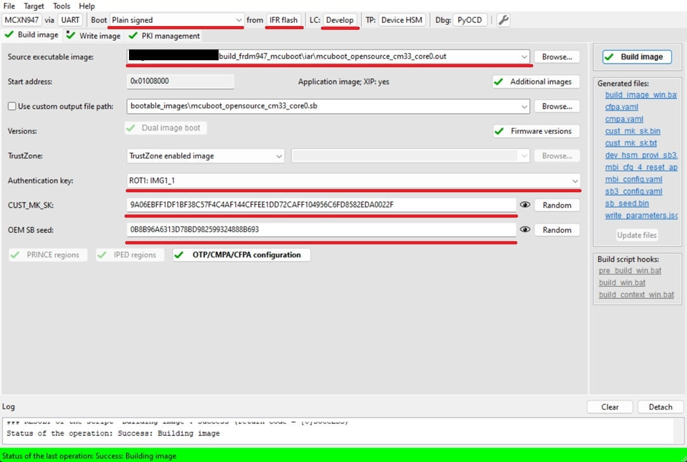
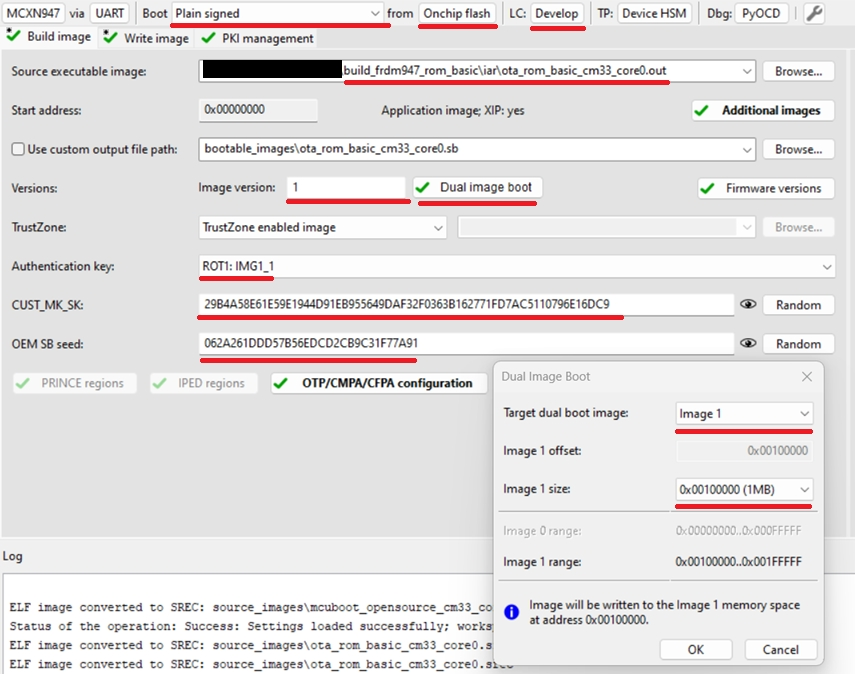
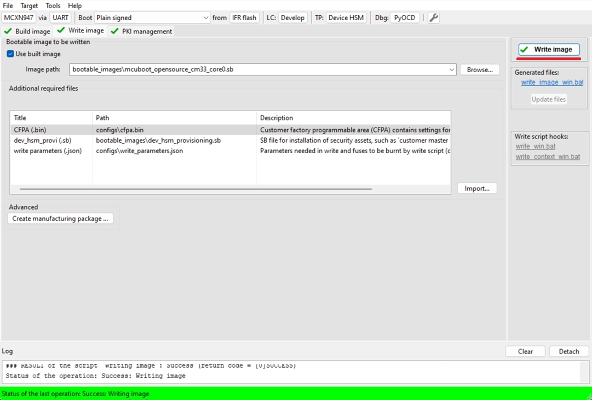
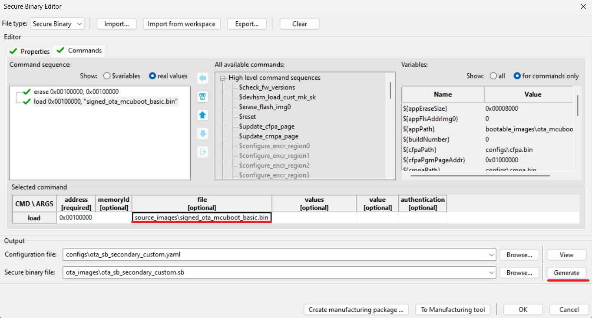
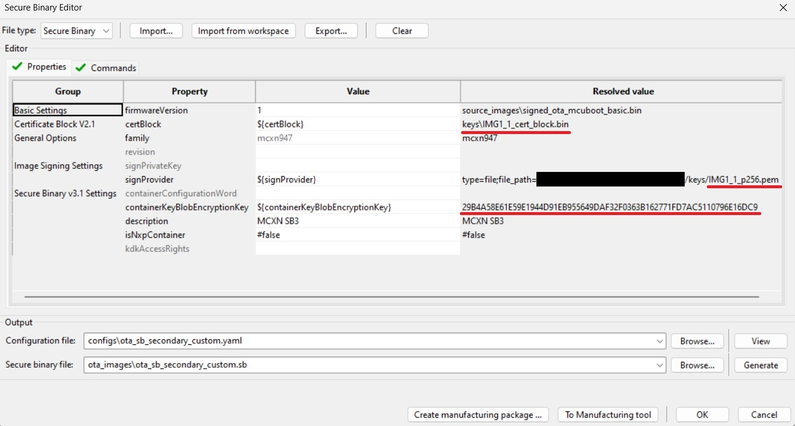
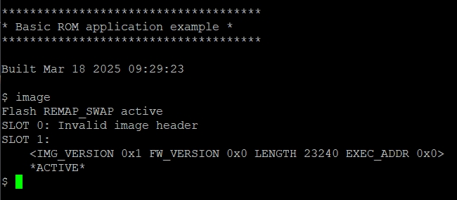
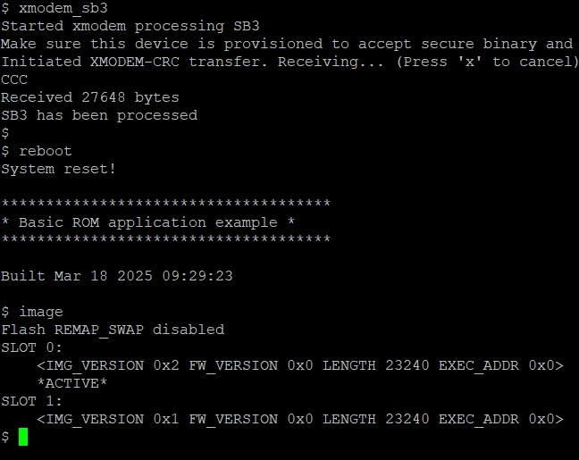
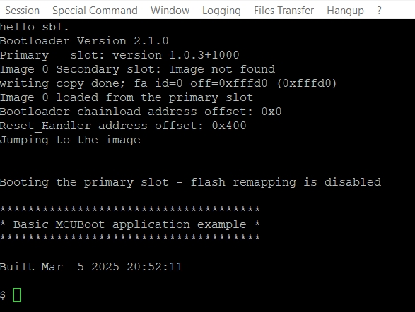
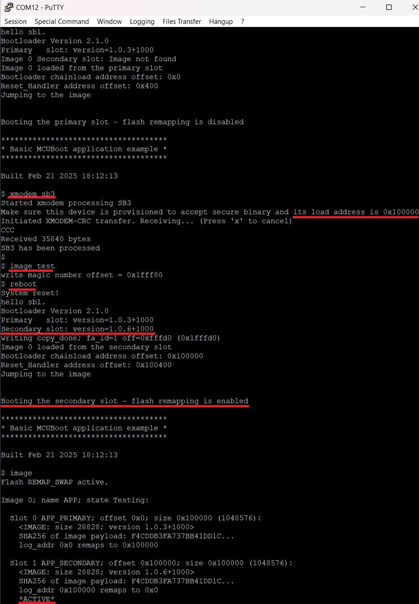

# MCXN - OTA update by using SB3 file

- [MCXN - OTA update by using SB3 file](#mcxn-ota-update-by-using-sb3-file)
   * [1. Provision the device](#1-provision-the-device)
   * [2. Prepare OTA images](#2-prepare-ota-images)
      + [2.1 ROM bootloader only use case](#21-rom-bootloader-only-use-case)
      + [2.2 MCUboot bootloader use case](#22-mcuboot-bootloader-use-case)
   * [3. Firmware update](#3-firmware-update)
      + [3.1 ROM bootloader only use case](#31-rom-bootloader-only-use-case)
      + [3.2 MCUboot bootloader use case](#32-mcuboot-bootloader-use-case)
   * [Supported Boards](#supported-boards)

In this walkthrough, if possible, the lifecycle of the device is not changed for development purposes, so the device can be restored to its initial state. In real scenarios, transitioning the chips to the corresponding lifecycle is based on specific requirements.

Common information related to SB3 is available in the documentation ['OTA update by using SB3 file'](sb3_common_readme.md).

## 1. Provision the device

The device must be provisioned to support SB3 processing. To simplify the workflow, the MCUXpresso Secure Provisioning Tool (SEC tool) is used.

To provision the device perform the following steps:

1. Erase the device
2. Build `mcuboot_opensource`+`ota_mcuboot_basic` or `ota_rom_basic` project depending what you want to evaluate
3. Get the device into ISP mode - typically on development boards hold the ISP button and press the reset button
4. Open the SEC tool and create new workspace for MCXN target device, test the ISP connection
5. Switch to PKI management tab
    * Click __Generate keys__ (leave default settings)

7. Build Image tab
    * Boot: __Plain signed__ from __IFR/Onchip flash__ based on `mcuboot_opensource` or `ota_rom_basic` location
    * Lifecycle: Develop
    * Select an __authentication key__ and generate __CUST_MK_SK__ and __OEM SB seed__
    * Enable Dual image support if you evaluate `ota_rom_basic`
        * Define Image version 1
        * Target dual boot image: __Image 1__
        * Image 1 size: 1MB

Following image is for MCUboot use case

Following image is for ROM only use case

    
8. Click __Build image__ 

9. Write image tab
    * Click __Write image__
    

## 2. Prepare OTA images

### 2.1 ROM bootloader only use case

MCXN uses flash remapping based on swap mechanism so SB3 OTA file always target Image 1 memory region. 

1. Build Image tab
    * Increase Image version from 1 to 2
    * __Build image__
2. Rename generated SB3 file `bootable_images/ota_rom_basic.sb` to `ota_rom_basic_image_1_v2.sb`

### 2.2 MCUboot bootloader use case

1. Build `ota_mcuboot_basic` and sign image by `imgtool` as usual by following steps in specific `example_board_readme.md` for your board. Copy the signed binary to your $sec_tool_workspace/source_images
2. Look into [ota_examples/\_common/sb3_templates](../_common/sb3_templates) directory and copy SB3 configuration templates for your device to your $sec_tool_workspace/configs
    * MCXN: `mcxn_sb3_cfg_primary_slot.yaml`

3. In SEC tool open __Tools/SB Editor__ and click __Import__ to `sb3_config_mcxn_secondary_slot.yaml`
    * Check and eventually fix paths to keys and image binary
    * click __Generate__

Note: Optionally, we can also create initial SB3 file containing initial (first) `ota_mcuboot_basic` application for primary/secondary slot (generated with additional __`--pad --confirm`__ imgtool arguments) to simulate manufacturing process, otherwise the initial signed image can be also loaded directly using ISP or other preferred method as usual.

## 3. Firmware update

For demonstration purpose we use [ExtraPutty](https://sourceforge.net/projects/extraputty/) tool as this fork of classic Putty has XMODEM support. Alternatively [TeraTerm](https://teratermproject.github.io/index-en.html) can be used.

### 3.1 ROM bootloader only use case

1. Run initial `ota_rom_basic` application loaded in chapter 1.
    * Note: alternatively unsigned application via debug session using preferred IDE (IAR, MCUX, VSCode) - in this case the `image` command returns invalid information as there is no valid image header to parse

2. Check image state and active flag location with `image` command

3. Run `xmodem_sb3` command
    * Send `ota_rom_basic_image_1_v2.sb` file via __Files Transfer/Xmodem (1k)__ 
    * Reboot
    * Check image state with `image` command

### 3.2 MCUboot bootloader use case

1. Load and run initial `ota_mcuboot_basic` application as usual - alternatively load initial SB3 via `blhost` and `receive-sb-file` command.
    

2. Run `xmodem_sb3` command
    * Send a SB3 file via __Files Transfer/Xmodem (1k)__ 
    * Mark written signed image as ready for install by `image test` command
    * Reboot

## Supported Boards

- [FRDM-MCXN947](../../_boards/frdmmcxn947/ota_examples/mcuboot_opensource/example_board_readme.md)
- [MCX-N9XX-EVK](../../_boards/mcxn9xxevk/ota_examples/mcuboot_opensource/example_board_readme.md)