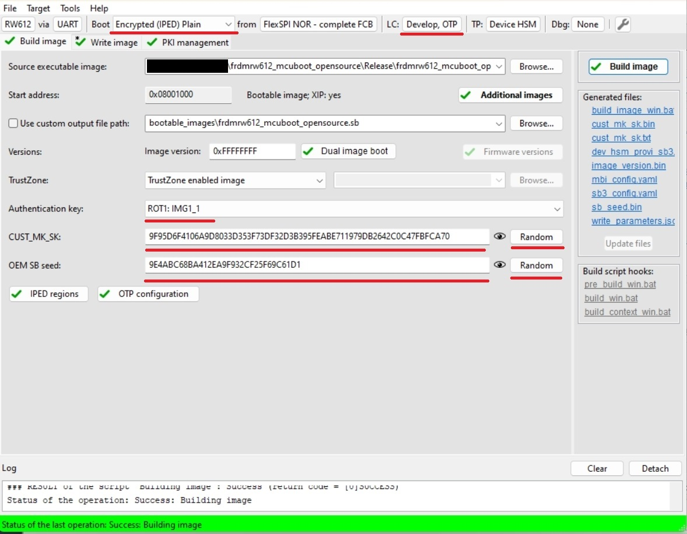
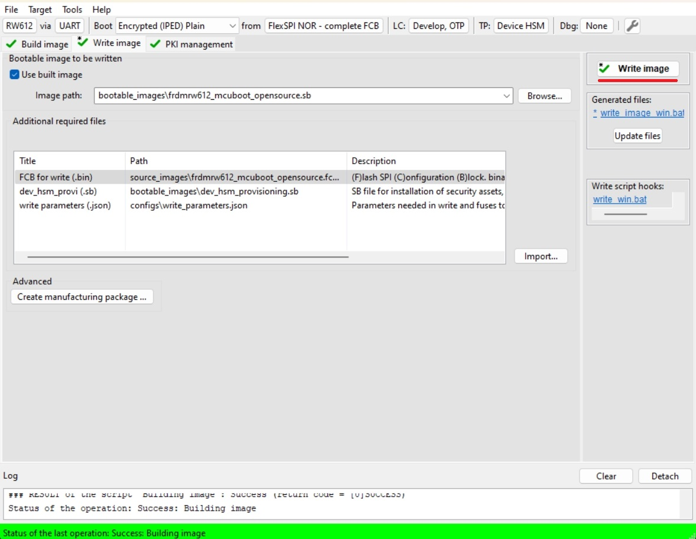
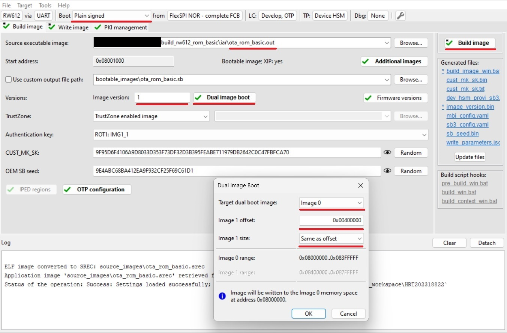
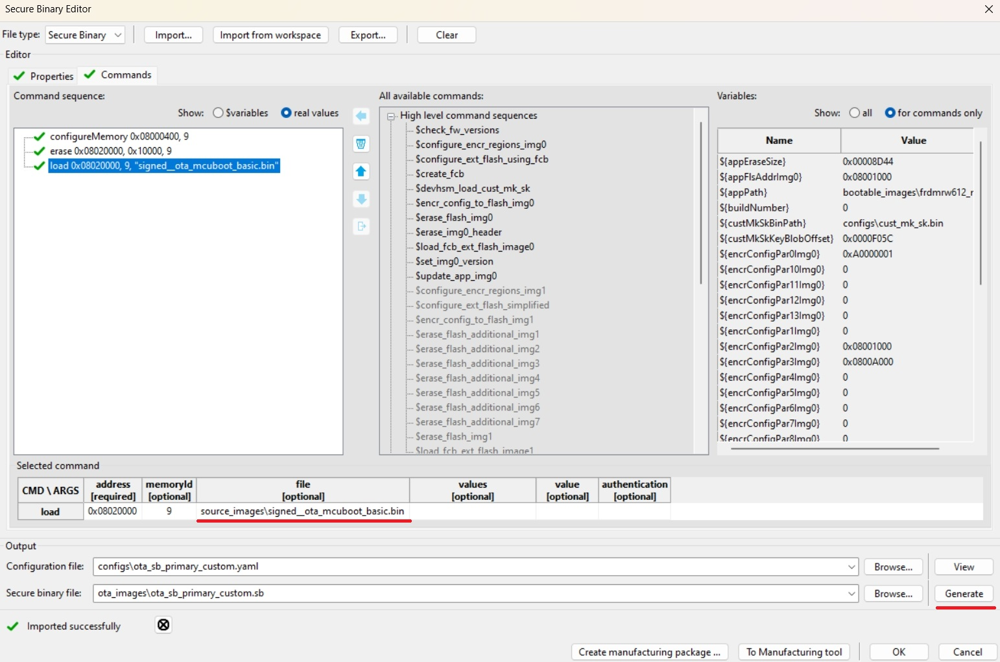
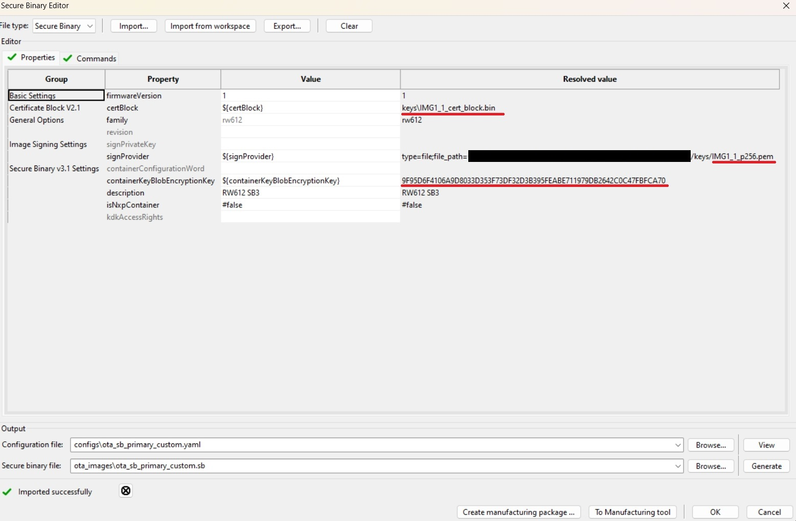
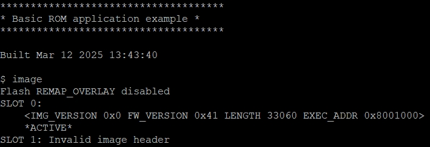
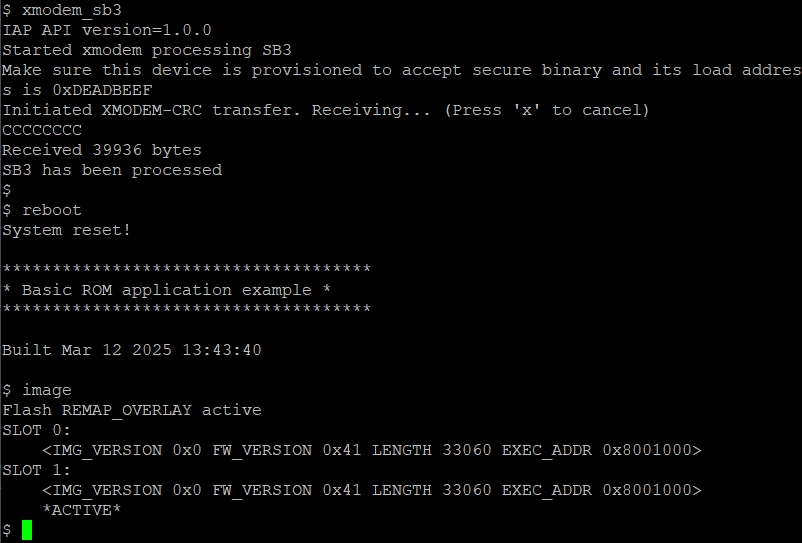
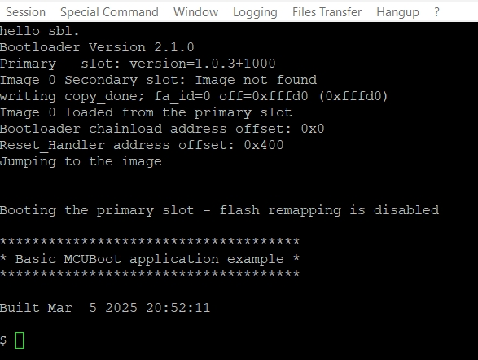
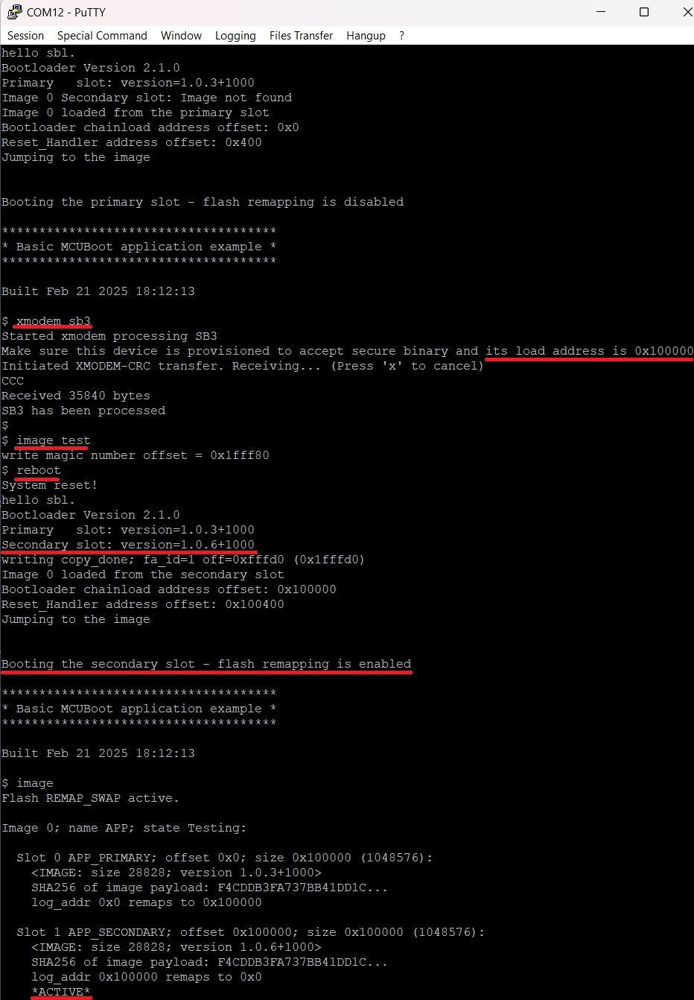

# RW61x - OTA update by using SB3 file

- [RW61x - OTA update by using SB3 file](#rw61x-ota-update-by-using-sb3-file)
   * [1. Provision the device](#1-provision-the-device)
   * [2. Prepare OTA images](#2-prepare-ota-images)
      + [2.1 ROM bootloader only use case](#21-rom-bootloader-only-use-case)
      + [2.2 MCUboot bootloader use case](#22-mcuboot-bootloader-use-case)
   * [3. Firmware update](#3-firmware-update)
      + [3.1 ROM bootloader only use case](#31-rom-bootloader-only-use-case)
      + [3.2 MCUboot bootloader use case](#32-mcuboot-bootloader-use-case)
   * [Supported Boards](#supported-boards)

In this walkthrough, if possible, the lifecycle of the device is not changed for development purposes, so the device can be restored to its initial state. In real scenarios, transitioning the chips to the corresponding lifecycle is based on specific requirements.

Common information related to SB3 is available in the documentation ['OTA update by using SB3 file'](sb3_common_readme.md).

## 1. Provision the device

The device must be provisioned to support SB3 processing. To simplify the workflow, the MCUXpresso Secure Provisioning Tool (SEC tool) is used.

To provision the device perform the following steps:

1. Erase the device
2. Build `mcuboot_opensource`+`ota_mcuboot_basic` or `ota_rom_basic` project depending what you want to evaluate
3. Get the device into ISP mode 
    * Typically on development boards hold the ISP button and press the reset button
4. Open the SEC tool and create new workspace for RW61x target device
    * Test the ISP connection in SEC tool
5. Switch to PKI management tab
    * Click __Generate keys__ (leave default settings)

RW61x doesn't properly support shadow registers to process SB3 files for development purposes, so the correct __RKTH__ and __CUST_MK_SK__ have to be provisioned. To provision these keys and keep the device in the __Develop lifecycle__, we will initially use __Encrypted (IPED) Plain__ boot type as a workaround. This initial operation provisions the device with RTKH and CUST_MK_SK permanently, but the board will still be usable for development purposes as OTP BOOT_CFG0 (fuseword 15) remains intact.

Note: User is advised to save SEC tool workspace (or atleast the keys somewhere) for future use

6. Build Image
    * Boot: __Encrypted (IPED) Plain__
    * Select `ota_rom_basic` or `mcuboot_opensource` output binary or ELF image as __Source executable image__
    * Lifecycle: __Develop, OTP__
    * Select an __authentication key__ and generate __CUST_MK_SK__ and __OEM SB seed__
    * Click __Build image__

7. Write image
    * Click __Write image__

Now the device is provisioned with __RKTH__ and __CUST_MK_SK__ without transition of the lifecycle.

8. Enable dual image support

__Note: This is needed only for ROM bootloader use case, otherwise skip this step__

The correct image offset and size has to be programmed to OTP fuseword 17 (BOOT_CFG2). In this example we use these values:

-  FLEXSPI_IMAGE_SIZE = 0x0 (The size of the boot image is considered to be equal to the offset of the second image)
-  FLEXSPI_IMAGE_OFFSET = 0x10 

Fuse the OTP using blhost:
`blhost -p COM3,115200 -- efuse-program-once 17 00008000`

Note: We set a 4MB offset here, but the final value is up to the user as this operation is also permanent. The device will still be usable for development purposes, as ROM evaluates only the valid image header of a signed image and looks for image version presence.

9. Erase device

This will erase encrypted image from the workaround.

10. Load MCUboot (only MCUboot use case)

Load unencrypted and unsigned `mcuboot_opensource` to the device using a programmer as usual

## 2. Prepare OTA images

### 2.1 ROM bootloader only use case

1. Build Image tab
    * Boot: Plain Signed
    * Select `ota_rom_basic` output binary or ELF image as __Source executable image__
    * Define Image version 1
    * Enable __Dual image boot__ with these parameters: 
        * Target dual boot image: __Image 0__
        * Image 1 offset: 0x00400000
        * Image 1 size: Same as offset
    * Click __Build image__
    

2. Rename generated SB3 file `bootable_images/ota_rom_basic.sb` to `ota_rom_basic_image_0_v1.sb`
3. Repeat step 1 with these changes:
    * Define Image version 2
    * In __Dual image boot__:
        * Target dual boot image: __Image 1__
    * Click __Build image__
4. Rename generated SB3 file `bootable_images/ota_rom_basic.sb` to `ota_rom_basic_image_1_v2.sb`

### 2.2 MCUboot bootloader use case

1. Build `ota_mcuboot_basic` and sign image by `imgtool` as usual by following steps in specific `example_board_readme.md` for your board. Copy the signed binary to your $sec_tool_workspace/source_images
2. Look into [ota_examples/\_common/sb3_templates](../_common/sb3_templates) directory and copy SB3 configuration templates for your device to your $sec_tool_workspace/configs
    * `rw612_sb3_cfg_primary_slot.yaml` for primary slot
    * `rw612_sb3_cfg_secondary_slot.yaml` for secondary slot
3. In SEC tool open __Tools/SB Editor__ and click __Import__ to import `sb3_config_rw612_secondary_slot.yaml`
    * Check and eventually fix paths to keys and image binary
    * click __Generate__

4. Repeat 3th step for `sb3_config_rw612_primary_slot.yaml`

Note: Optionally, we can also create initial SB3 file containing initial (first) `ota_mcuboot_basic` application for primary or secondary slot to simulate manufacturing process. This image has to be generated with additional __`--pad --confirm`__ imgtool arguments. The initial signed image can be also loaded directly using ISP (via `blhost` and `receive-sb-file` command) or other preferred method as usual.
    
## 3. Firmware update

For demonstration purpose we use [ExtraPutty](https://sourceforge.net/projects/extraputty/) tool as this fork of classic Putty has XMODEM support. Alternatively [TeraTerm](https://teratermproject.github.io/index-en.html) can be used.

### 3.1 ROM bootloader only use case

1. Load and run initial the initial `ota_rom_basic` application with one of these ways:
    * load signed image via `blhost` commands: 
        * `blhost -p COM3,115200 -- fill-memory 0x20001000 0x4 0xC0000004`
        * `blhost -p COM3,115200 -- configure-memory 0x9 0x20001000`
        * `blhost -p COM3,115200 -t 20000 receive-sb-file ota_rom_basic_image_0_v1`

    or
    
    * load unsigned application via debug session - in this case the `image` command returns invalid information as there is no valid image header to parse

2. Check image state and active flag location with `image` command
    * See active flag location

3. Run `xmodem_sb3` command
    * Send `ota_rom_basic_image_1_v2` file via __Files Transfer/Xmodem (1k)__ 
    * Reboot
    * Check image state with `image` command
        * See active flag location

### 3.2 MCUboot bootloader use case

1. Load and run initial the initial `ota_mcuboot_basic` application with one of these ways:
    * load signed image via `blhost` commands: 
        * `blhost -p COM3,115200 -- fill-memory 0x20001000 0x4 0xC0000004`
        * `blhost -p COM3,115200 -- configure-memory 0x9 0x20001000`
        * `blhost -p COM3,115200 -t 20000 receive-sb-file signed_padded_ota_mcuboot_basic_primary_slot.sb`

    or
    
    * load unsigned application via debug session - in this case the `image` command returns invalid information as there is no valid image header to parse
    
2. Check image state and active flag location with `image` command

3. Run `xmodem_sb3` command
    * Send a SB3 file via __Files Transfer/Xmodem (1k)__ 
    * Make sure the selected SB3 targets inactive slot otherwise the device can be bricked
    * Mark written signed image as ready for install by `image test` command
    * Reboot

## Supported Boards

- [RD-RW612-BGA](../../_boards/rdrw612bga/ota_examples/mcuboot_opensource/example_board_readme.md)
- [FRDM-RW612](../../_boards/frdmrw612/ota_examples/mcuboot_opensource/example_board_readme.md)